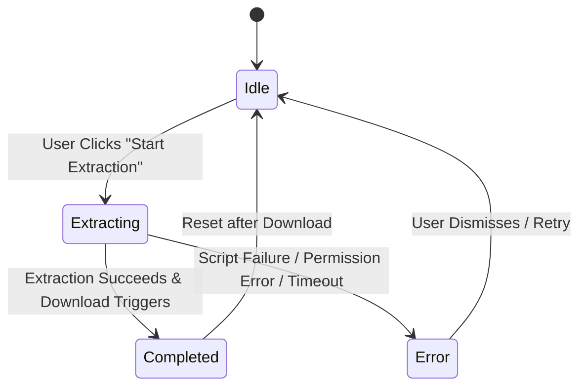

# Data Model: Button Action for Start Extraction

This document outlines the in-memory state models and transitions used in the popup script to manage extraction execution.

## Entities

### ExtractionJob

Represents the state of the active extraction process running from the popup user interface.

| Attribute | Type | Description |
|-----------|------|-------------|
| `tabId` | Integer | ID of the browser tab where script is injected. |
| `status` | String | Current execution status. One of: `'idle'`, `'extracting'`, `'completed'`, `'error'`. |
| `error` | String (optional) | Error details if status is `'error'`. |
| `settings` | Object | The settings snapshot retrieved from storage at the start of the job. |

## State Transitions

### Transition Triggers

1. **Start Job**: User clicks the start extraction button. System queries the active tab and transitions status to `'extracting'`.
2. **Success**: Extraction script finishes converting the page, returns Markdown/ZIP, and download starts. System transitions status to `'completed'`.
3. **Failure**: Tab permission is denied, injection fails, or execution throws an error. System sets the `error` attribute and transitions to `'error'`.
