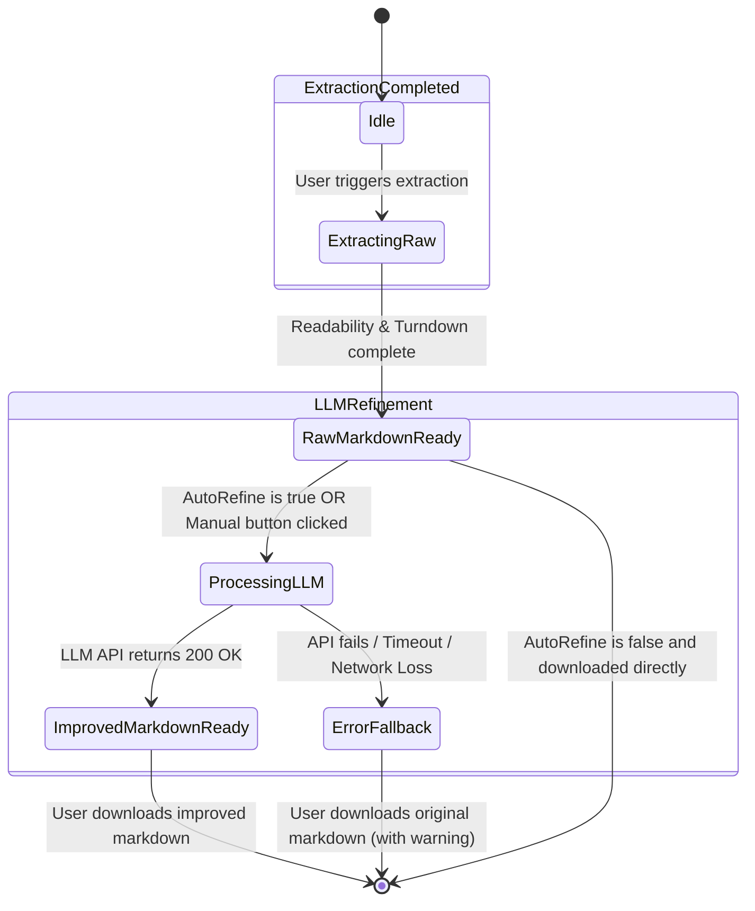

# Data Model: LLM API Integration

## Persistent State (Extension Local Storage)

The extension's configuration is persisted using the standard Web Extensions Storage API (`chrome.storage.local`). The following schema defines the configuration state.

### `LLMConfig` Entity

This entity holds all settings required to configure, test, and run LLM operations.

| Field Name | Type | Default Value | Validation Rules | Description |
| :--- | :--- | :--- | :--- | :--- |
| `llmEnabled` | Boolean | `false` | None | Toggles all LLM-assisted markdown improvement features. |
| `llmProvider` | String | `'gemini'` | Must be one of: `'gemini'`, `'openai'`, `'anthropic'`, `'ollama'` | Active LLM service provider. |
| `llmApiKey` | String | `''` | Required if provider is not `'ollama'`. Must not be empty if enabled. | API key used for authentication. |
| `llmModel` | String | `'gemini-1.5-flash'` | Required. Must not be empty. | Model identifier to pass to the API payload. |
| `llmCustomEndpoint` | String | `''` | Must be a valid HTTP/HTTPS URL if provider is `'ollama'` or custom. | Custom endpoint URL. Defaults to Ollama's `http://localhost:11434` if empty. |
| `llmAutoRefine` | Boolean | `false` | None | Controls if improvement runs automatically on extraction (`true`) or manually (`false`). |
| `llmPromptTemplate` | String | (Default template) | Required. | The system prompt structure used to instruct the model. |
| `llmObjective` | String | `''` | None | User's optional objective/goal to guide markdown refinement. |

---

## Session State (Transient State)

Tracks the state of an extraction session in the UI.

### `ExtractionSession` Entity

| Field Name | Type | Default Value | Description |
| :--- | :--- | :--- | :--- |
| `rawMarkdown` | String | `''` | Content extracted straight from DOM readability/turndown. |
| `improvedMarkdown`| String | `''` | Content returned after successful LLM processing. |
| `llmStatus` | String | `'idle'` | Active request status: `'idle'`, `'processing'`, `'success'`, `'error'`. |
| `llmErrorMessage` | String | `''` | Detailed description of the error if `llmStatus` is `'error'`. |

---

## State Transitions

